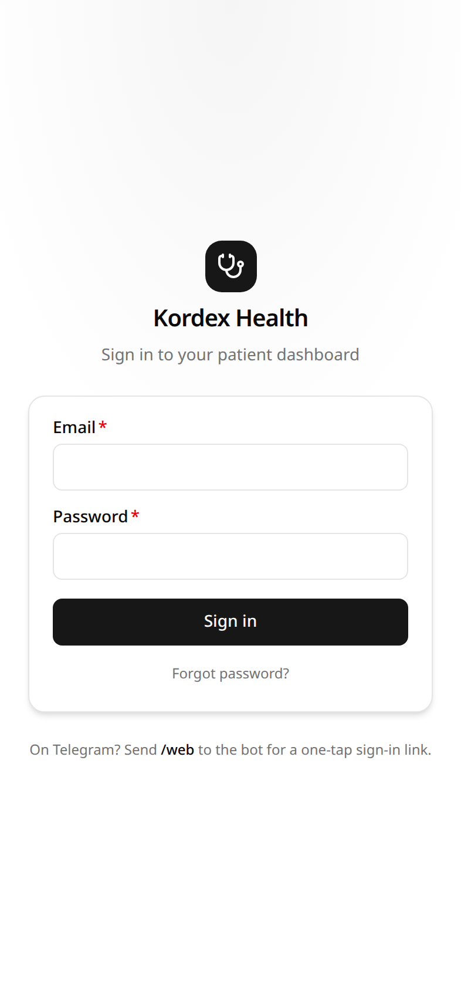
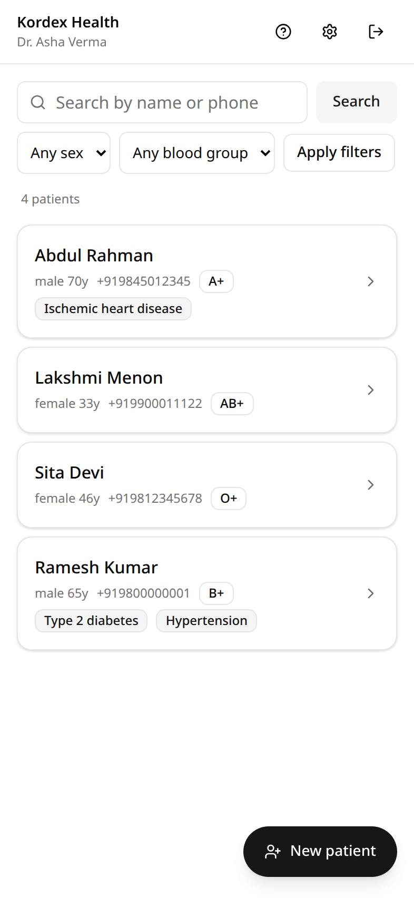
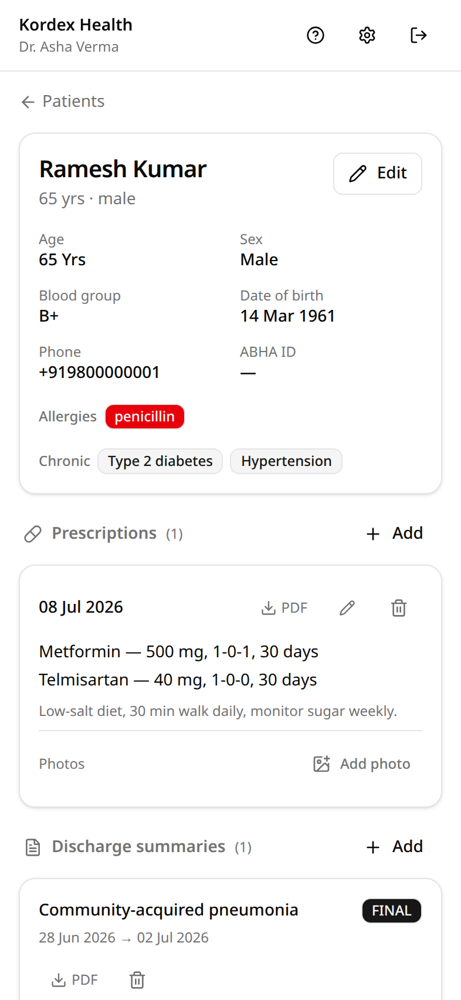

# Kordex Health

**Patient records for Indian doctors — as easy as texting.**

Kordex Health is a lightweight system of record for solo practitioners and small
clinics. Doctors manage patients, visits, prescriptions, and discharge summaries
from a mobile-first web dashboard — or by simply messaging a Telegram bot in
plain language ("add a visit for Ramesh, fever 2 days, gave paracetamol").
Either way, the data lands in the same audited, doctor-scoped record.

**Web dashboard · Telegram assistant · REST API** — one system of record behind all three.

## Screenshots

| Sign in | Dashboard | Patient record |
| --- | --- | --- |
|  |  |  |

## What it does

- **Patients** — demographics, blood group, allergies, chronic conditions,
  ABHA ID. Fuzzy search by name or phone, filters, pagination.
- **Visits (encounters)** — complaint, examination, vitals, diagnosis, plan.
- **Prescriptions** — structured medication rows (dose / frequency / duration),
  rendered to PDF on demand and served via short-lived signed URLs.
- **Discharge summaries** — built from structured fields (never freehand LLM
  text), draft → finalize workflow; finalized summaries are immutable.
- **Photos & scans** — attach prescription/report photos per record from the
  web, or just send a photo to the Telegram bot; files live in R2.
- **Telegram assistant** — `/find`, `/add`, `/visit`, `/prescribe`, `/summary`,
  or free-form messages (including Hinglish). Every write is confirmed by the
  doctor before it lands. Photos sent to the bot are stored against the patient;
  the bot can send stored photos and PDFs back.
- **Audit trail** — every read and write on a doctor's records is logged and
  visible in the dashboard's Activity page.
- **Self-service account** — password change, Telegram link/unlink, and
  password reset via the linked Telegram chat (no email required).

Built mobile-first: the dashboard is designed for a phone in a clinic — 40px+
tap targets, bottom-sheet dialogs, thumb-reachable actions.

## Architecture

**Stack:** Next.js (App Router) on Vercel · Supabase Postgres via Prisma · Cloudflare R2 for documents · OpenAI tool-calling agent for the Telegram assistant.

- **All authorization lives in the service, not the agent.** API requests need
  `Authorization: Bearer dct_...`; every query is scoped to the token's doctor.
  Tokens are stored as sha256 hashes only. Web sessions use the same
  doctor-scoped services.
- **The agent cannot self-confirm writes.** Telegram writes go through a
  `PendingAction`: the agent proposes, the doctor sees the exact payload, and
  confirmation is only accepted from a *later* message.
- **Every access is audited** — writes atomically (same transaction), reads
  best-effort.

## Getting started

1. Create a Supabase project (prefer an Indian region, e.g. `ap-south-1`) and an R2 bucket.
2. `cp .env.example .env` and fill in values.
3. `npx prisma migrate dev --name init`
4. Provision a doctor, a web password, and their first API token:
   ```bash
   npm run create-doctor -- --name "Dr. A Sharma" --email a@example.com
   npm run set-password -- --email a@example.com --password "********"
   ```
5. `npm run dev` and sign in at `http://localhost:3000`.

### Telegram bot

Set `TELEGRAM_BOT_TOKEN`, `TELEGRAM_BOT_USERNAME`, and `TELEGRAM_WEBHOOK_SECRET`,
then register the webhook and command menu:

```bash
npm run telegram-setup -- --url https://<your-deployment>
```

> **Re-run this after every deployment-URL change** — the webhook does not
> follow the deployment, and the bot silently stops responding if it points at
> a dead URL.

Doctors link their chat from **Account → Connect Telegram** (a one-time code,
valid 48 hours from the moment it's generated). Local testing without Telegram:
`npm run agent -- --email <doctor> "message"`.

## API

All routes require `Authorization: Bearer <token>`. Dates are `YYYY-MM-DD`.

| Method | Route | Purpose |
| --- | --- | --- |
| GET | `/api/patients?q=&sex=&bloodGroup=&limit=&offset=` | Search own patients |
| POST | `/api/patients` | Create patient |
| GET / PATCH | `/api/patients/:id` | Patient details / update |
| GET / POST | `/api/patients/:id/encounters` | Visits: list / record |
| GET / PATCH | `/api/encounters/:id` | Visit details / update |
| GET / POST | `/api/patients/:id/prescriptions` | Prescriptions: list / create |
| GET | `/api/prescriptions/:id` | Prescription details |
| GET | `/api/prescriptions/:id/document` | Signed PDF URL (renders on demand) |
| GET / POST | `/api/patients/:id/discharge-summaries` | Summaries: list / create (DRAFT) |
| GET / PATCH | `/api/discharge-summaries/:id` | Summary details / update / finalize |
| GET | `/api/discharge-summaries/:id/document` | Signed PDF URL |
| POST | `/api/attachments` → PUT → `/api/attachments/:id/complete` | Direct-to-R2 photo upload |
| GET | `/api/audit-logs?limit=&offset=` | Own audit trail |
| POST | `/api/telegram/webhook` | Telegram webhook (secret-token gated) |

`POST` create endpoints accept an `Idempotency-Key` header: a retry with the
same key replays the stored response instead of creating a duplicate.

## Tests

- `npm test` — vitest unit tests (`tests/`): validation schemas, token hashing,
  error mapping, PDF rendering, pending-action confirm gating.
- `npm run eval` — agent evals (`scripts/agent-eval.ts`): drives real
  conversations (Hinglish shorthand, typos, prompt injection, cross-tenant
  probes, ambiguous names…) through the live OpenAI API against a throwaway
  doctor, then asserts on database state and judges reply quality with an LLM.
- A separate Playwright suite (mobile-viewport layout audits: tap-target sizes,
  element overlaps, horizontal scroll) lives in the `doctor-openclaw-e2e` repo.

## Roadmap

- Summary amendments (versioned corrections instead of edit-FINAL)
- Per-doctor agent config (custom prompts/tools, external system adapters)
